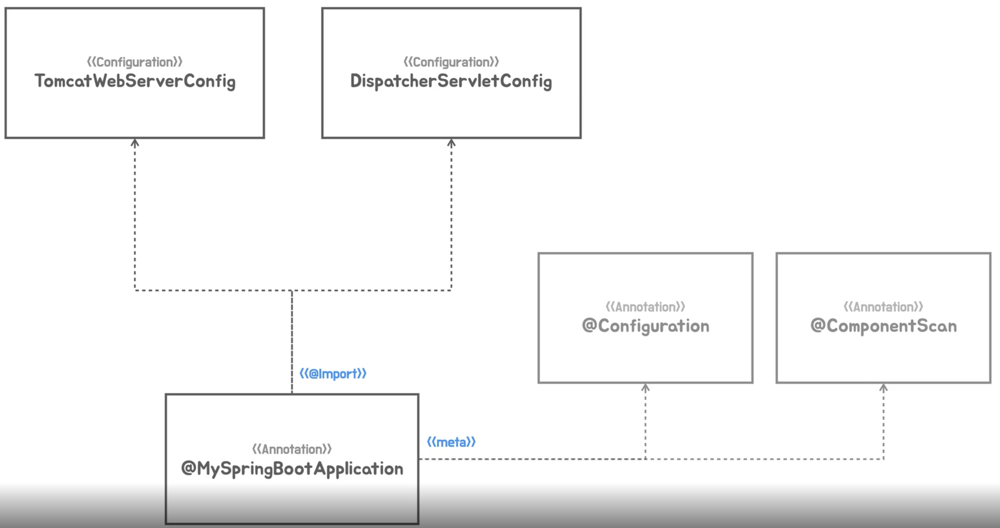

# 주 생성자, 부생성자

생성자에는 primary constructor와 secondary constructor가 있다.

이름대로 주 생성자는 메인이고, secondary constructor는 단순히 주생성자를 호출하기 위한 단계일 뿐이다. \
예시는 아래와 같다.

```java
 final class Cash {
    private final int cents;
    private final String currency;

    public Cash() { // secondary
        this(0);
    }

    public Cash(int cts) { // secondary
        this(cts, "USD");
    }

    public Cash(int cts, String crn) { // primary
        this.cents = cts;
        this.currency = crn;
    }
    // methods here
}
```

<figure><figcaption></figcaption></figure>


[https://velog.io/@injoon2019/%EC%A3%BC-%EC%83%9D%EC%84%B1%EC%9E%90-%EB%B6%80-%EC%83%9D%EC%84%B1%EC%9E%90](https://velog.io/@injoon2019/%EC%A3%BC-%EC%83%9D%EC%84%B1%EC%9E%90-%EB%B6%80-%EC%83%9D%EC%84%B1%EC%9E%90)
