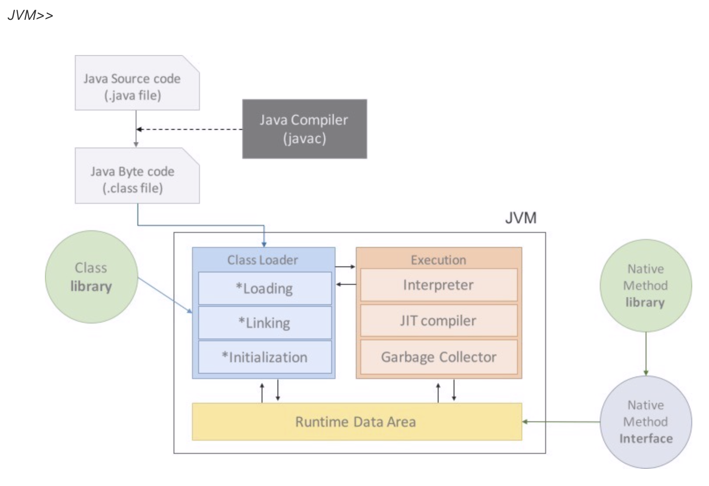

# ConfigMap

* 애플리케이션의 설정 값을 컨테이너에 주입하고 싶을 때 사용하는 리소스이다.
* Pod에서 직접 환경변수를 관리하지 않고, ConfigMap을 분리하여 목적에 따라 설정 데이터를 다르게 주입할 수 있다.
* 아래 그림과 같이 dev, test, prd  환경에 맞는 설정 값을 주입하여 사용할 수 있다.

<figure><figcaption></figcaption></figure>

